# orbiq

La plataforma sobre la que un negocio administra su operación. La primera capacidad es
**inventario y ventas** para un negocio de barrio: cada venta queda en el historial del inventario,
y el dueño sabe qué tiene, a qué precio y qué se está acabando, sin cuaderno. Se usa desde el
celular, la tablet o el computador. El porqué completo está en
[`docs/project/brief.md`](docs/project/brief.md).

## Cómo se ve

| | Celular | Computador |
| --- | --- | --- |
| **Inicio** — lo vendido hoy, lo agotado y los atajos | 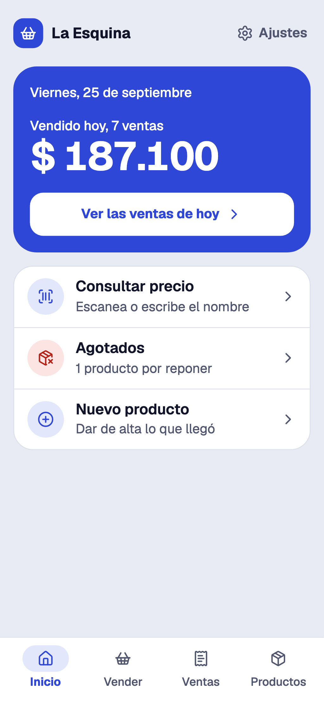 | 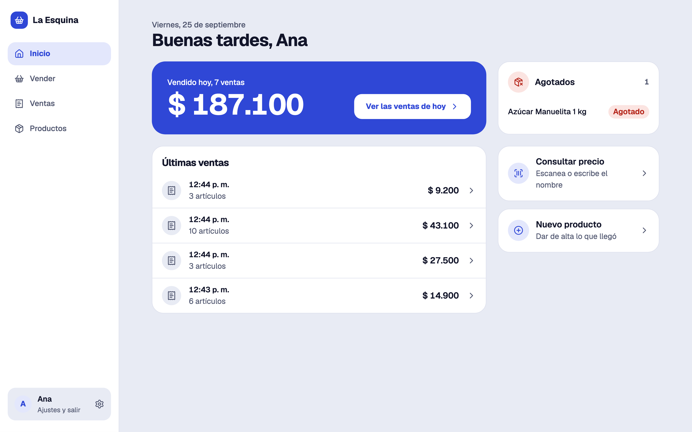 |
| **Vender** — los más vendidos a un toque, lector de códigos o cámara | 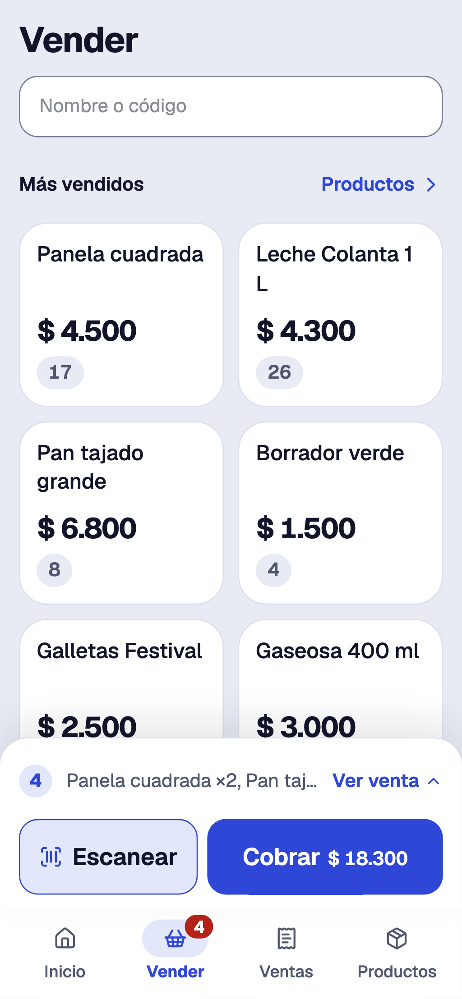 | 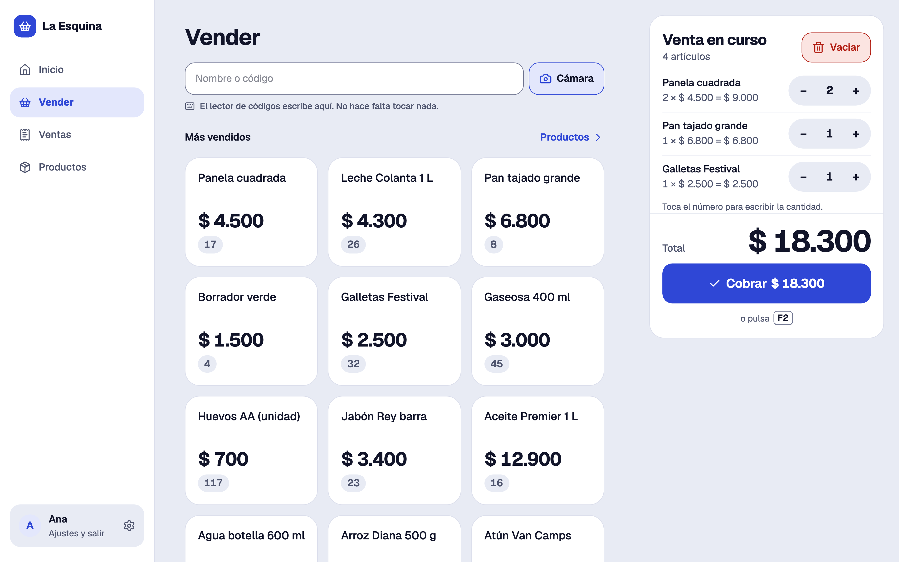 |
| **Productos** — búsqueda, filtros y existencias | 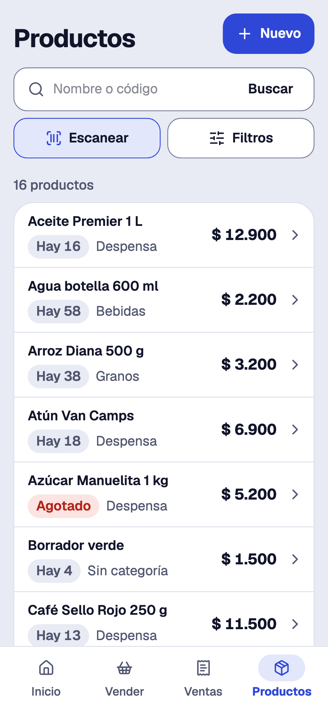 | 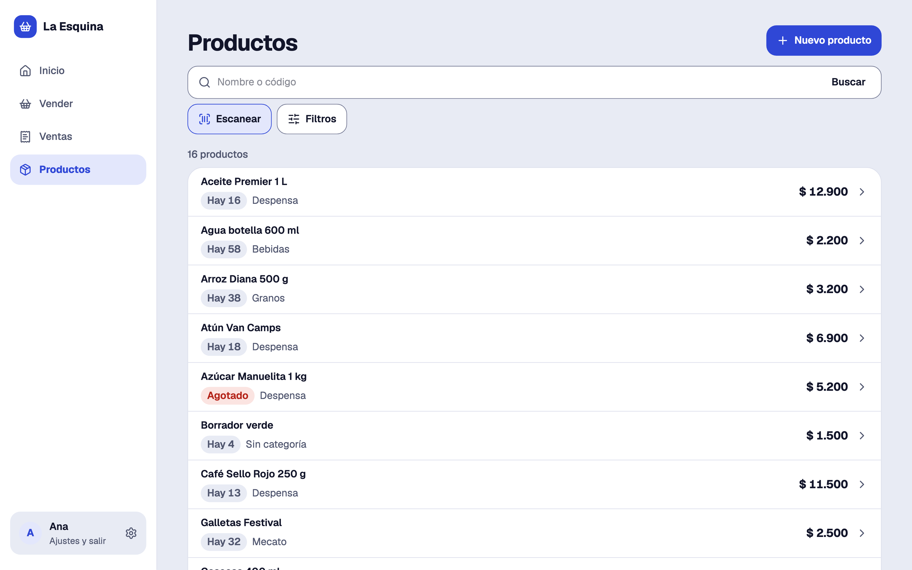 |
| **Ficha** — precio, existencias y el historial de cada movimiento | 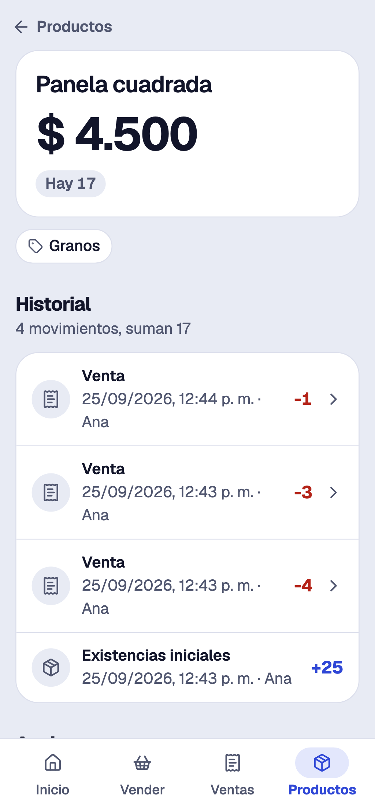 | 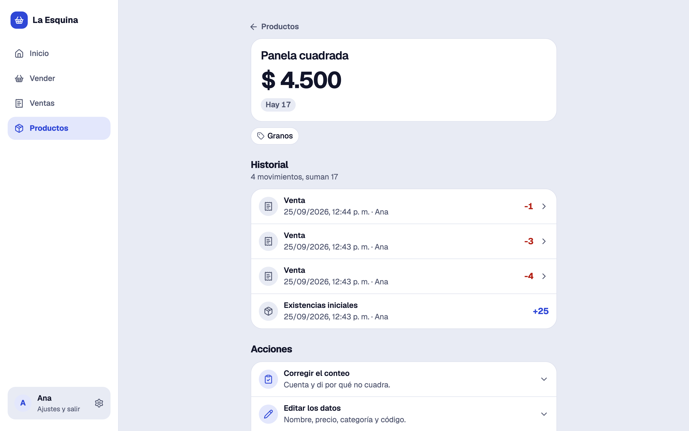 |
| **Ventas** — por día, con su total; anular devuelve las existencias | 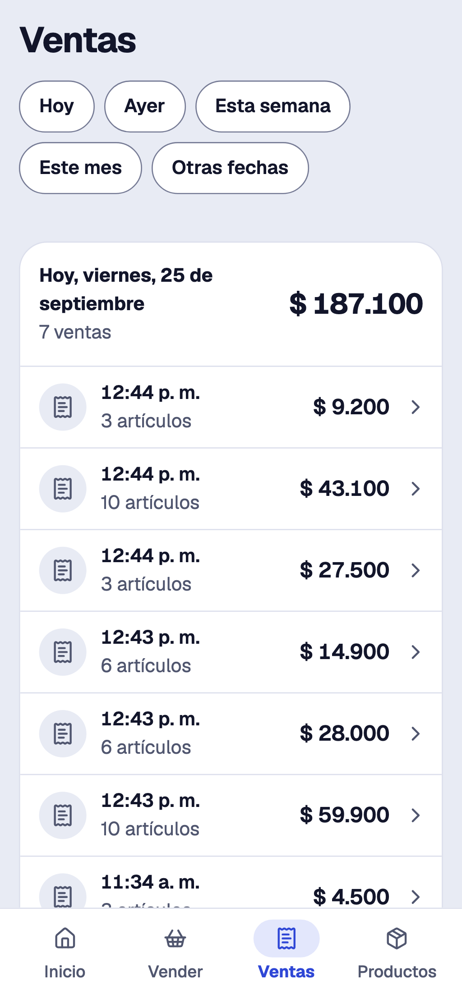 | 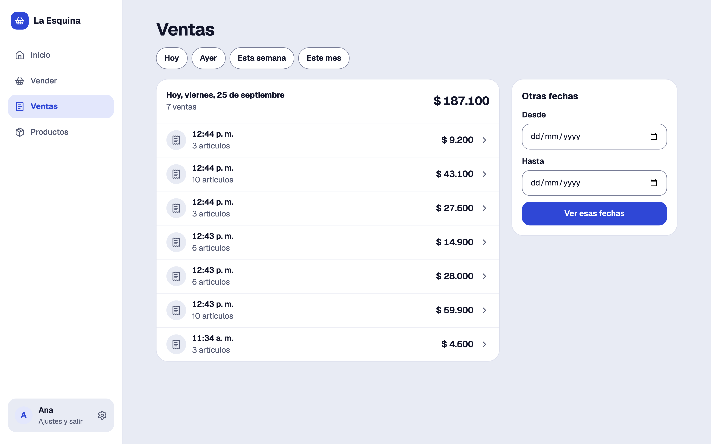 |
| **Acceso** | 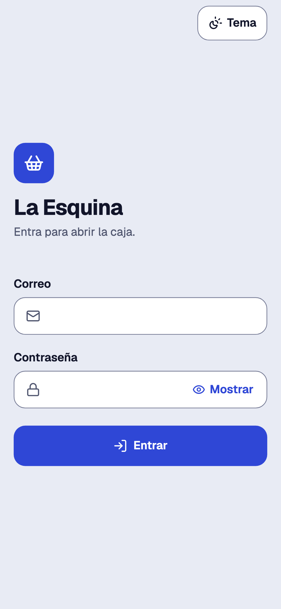 | 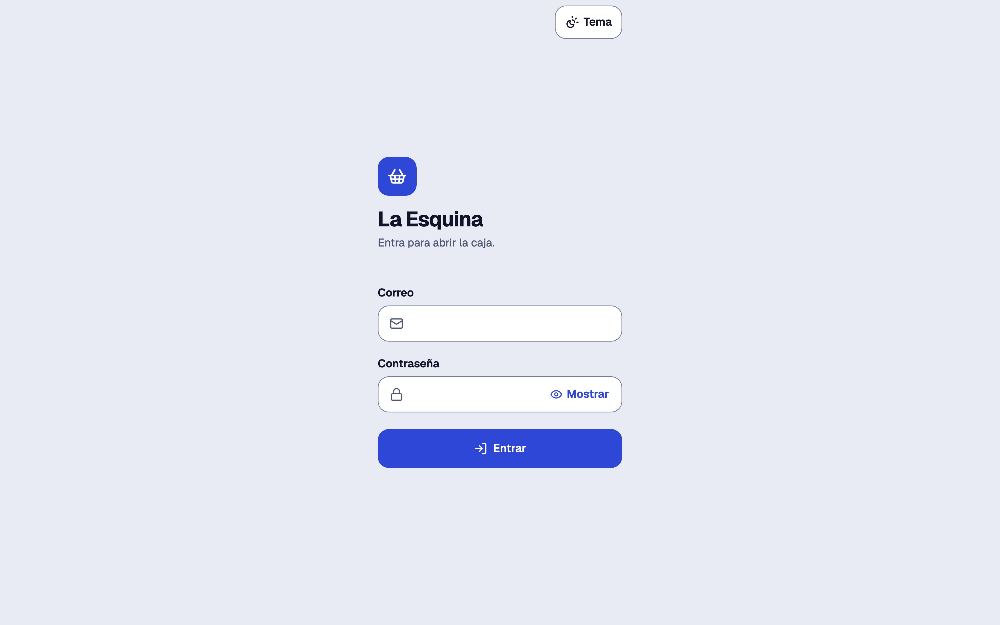 |

También en tema oscuro, que sigue al del dispositivo o se elige en Ajustes:

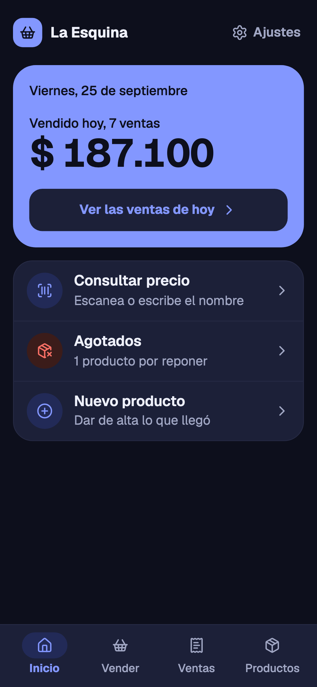

## Con qué está hecho

Next.js (App Router) con React y Tailwind CSS, PostgreSQL en Neon con Drizzle, Better Auth para la
sesión del dueño. En producción corre en Cloudflare Workers: un Worker, una base y un Hyperdrive por
negocio. El detalle y el porqué de cada pieza, en
[`docs/project/architecture.md`](docs/project/architecture.md).

## Correrlo en local

Hace falta Node.js (la versión con que se desarrolla está en `architecture.md` § Stack) y un
proyecto de Neon para desarrollo.

```sh
npm install
cp .env.example .env          # y llenar los valores; cada uno dice de dónde sale
npm run db:migrate            # crea las tablas
npm run alta-dueno -- --correo=tu@correo.com --nombre="Tu nombre"   # pide la contraseña
npm run dev                   # http://localhost:3000
```

`npm run sembrar-demo` carga un catálogo de ejemplo de tienda de barrio, si se quiere ver con datos.

## Pruebas

```sh
npm test              # dominio, con Vitest
npm run typecheck
npm run lint
npm run test:e2e      # la aplicación entera en el navegador, con Playwright, contra la base de .env
npm run db:verify     # las reglas que la base hace cumplir por su cuenta
```

La suite e2e crea y borra sus propios datos: corre igual contra una base vacía.

## Desplegar

Cada negocio es un entorno de `wrangler.jsonc`. Una vez dado de alta:

```sh
npm run deploy -- --env tienda-miriam
```

Dar de alta un negocio nuevo —la base, su Hyperdrive, su dueño, su secreto y su dirección— son ocho
pasos, en [`architecture.md` § Dar de alta un negocio](docs/project/architecture.md#dar-de-alta-un-negocio).
`npm run preview` corre la aplicación en el runtime de Workers en local, antes de desplegar.

Hoy en producción: **Lumy Bella** (antes Tienda Miriam; el entorno sigue siendo `tienda-miriam`), en
https://orbiq-tienda-miriam.juan-account.workers.dev.

## Cómo se trabaja aquí

El proyecto se lleva con tareas escritas, decisiones registradas y un diario. Para retomarlo:
[`STATUS.md`](STATUS.md) (generado) y [`AGENTS.md`](AGENTS.md). Las decisiones de fondo están en
[`docs/decisions/`](docs/decisions/), y cada tarea en [`docs/tasks/`](docs/tasks/).
